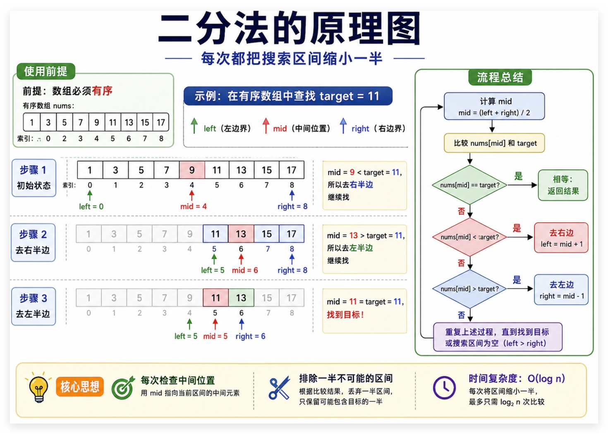

## 常见算法记录
### 数组

#### 二分查找

二分查找的基本原理如下图中所示。



其中二分查找的实现方法分为多种，较为简单的一种是使用双闭区间，我们定义 target属于一个双闭区间 ，**也就是[left, right] **。

区间的定义这就决定了二分法的代码应该如何写，**因为定义target在[left, right]区间，所以有如下两点：**

- while (left <= right) 要使用 <= ，因为left == right是有意义的，所以使用 <=
- if (nums[middle] > target) right 要赋值为 middle - 1，因为当前这个nums[middle]一定不是target，那么接下来要查找的左区间结束下标位置就是 middle - 1

```cpp
class Solution {
public:
    int search(vector<int>& nums, int target) {
        int left = 0;
        int right = nums.size() - 1; // 定义target在左闭右闭的区间里，[left, right]
        while (left <= right) { // 当left==right，区间[left, right]依然有效，所以用 <=
            int middle = left + ((right - left) / 2);// 防止溢出 等同于(left + right)/2
            if (nums[middle] > target) {
                right = middle - 1; // target 在左区间，所以[left, middle - 1]
            } else if (nums[middle] < target) {
                left = middle + 1; // target 在右区间，所以[middle + 1, right]
            } else { // nums[middle] == target
                return middle; // 数组中找到目标值，直接返回下标
            }
        }
        // 未找到目标值
        return -1;
    }
};
```

#### 双指针

其中双指针的作用是，使用一个快指针和一个慢指针，从而在一个for循环中完成本来应该在两个for循环中完成的任务。

例如在leetcode题目中，存在一移除相同元素的题目。

给你一个数组 `nums` 和一个值 `val`，你需要 **[原地](https://baike.baidu.com/item/原地算法)** 移除所有数值等于 `val` 的元素。元素的顺序可能发生改变。然后返回 `nums` 中与 `val` 不同的元素的数量。

假设 `nums` 中不等于 `val` 的元素数量为 `k`，要通过此题，您需要执行以下操作：

- 更改 `nums` 数组，使 `nums` 的前 `k` 个元素包含不等于 `val` 的元素。`nums` 的其余元素和 `nums` 的大小并不重要。
- 返回 `k`。


其实第一次看到该题目，想到的是使用STL中的erase直接删除元素，但是刷题过程中最好不要使用这么投机取巧的方法。常规方法下，我们的做法是：**使用两层for循环，第一层中寻找到指定的元素，接着在下一次for循环中将后面的元素前移，覆盖掉该元素**

而使用双指针的做法是，慢指针遇到target不向前移动，用快指针的值覆盖掉慢指针的值。实现方法如下：

```cpp
class Solution {
public:
    int removeElement(vector<int>& nums, int val) {
        int slow = 0;

        for (int fast = 0; fast < nums.size(); fast++) {
            if (val != nums[fast]) {
                nums[slow++] = nums[fast];
            }
        }

        return slow;
    }
};
```

双指针的用法基本上就是这样，还有一道例题如下所示，其中使用的fill方法用于将内容填充为指定的数字。

```cpp
class Solution {
public:
    void moveZeroes(vector<int>& nums) {
        int slow = 0;

        for (int fast = 0; fast < nums.size(); fast++) {
            if (nums[fast] != 0) {
                nums[slow++] = nums[fast];
            }
        }

        fill(nums.begin() + slow, nums.end(), 0);
    }
};
```


#### 滑动窗口

所谓滑动窗口，**就是不断的调节子序列的起始位置和终止位置，从而得出我们想要的结果**。该算法主要用于解决，子啊一个数组或者字符串中，寻找满足某种条件的连续子数组。例如：长度为 k 的连续子数组最大和、最长无重复字符子串等问题。


其中一个典型的题目就是，给定一个含有 n 个正整数的数组和一个正整数 s ，找出该数组中满足其和 ≥ s 的长度最小的连续子数组，并返回其长度。如果不存在符合条件的子数组，返回 0。

所谓的连续子数组，指的就是一个数组中一个连续的部分。那么对于上面的问题，我们的代码如下所示：

``` cpp
class Solution {
public:

    int minSubArrayLen(int target, vector<int>& nums) {
        int left = 0, sum = 0, ans = INT32_MAX;
        
        for (int right = 0; right < nums.size(); right++) {
            sum += nums[right];
            while (sum >= target) {
                ans = min(ans, right - left + 1);
                sum -= nums[left++];
            }
        }
        return ans == INT32_MAX ? 0 : ans;
    }

};
```

同样的这道水果篮子的题目，同样用到了滑动窗口的思想，只不过我通过一个map来维护窗口中的元素，以及其个数。实现的代码如下：

```cpp
class Solution {
public:
    int totalFruit(vector<int>& fruits) {
        unordered_map<int, int> mp;
        int left = 0, ans = 0;
        for (int right = 0; right < fruits.size(); right++) {
            if (mp.size() == 2 && mp.find(fruits[right]) == mp.end()) {
                while (mp.size() == 2) {
                    if (--mp[fruits[left]] == 0) {
                        mp.erase(fruits[left]);
                    }
                    left++;
                }
            }
            mp[fruits[right]]++;
            ans = max(ans, right - left + 1);
        }
        return ans;
    }

};
```


### 链表
