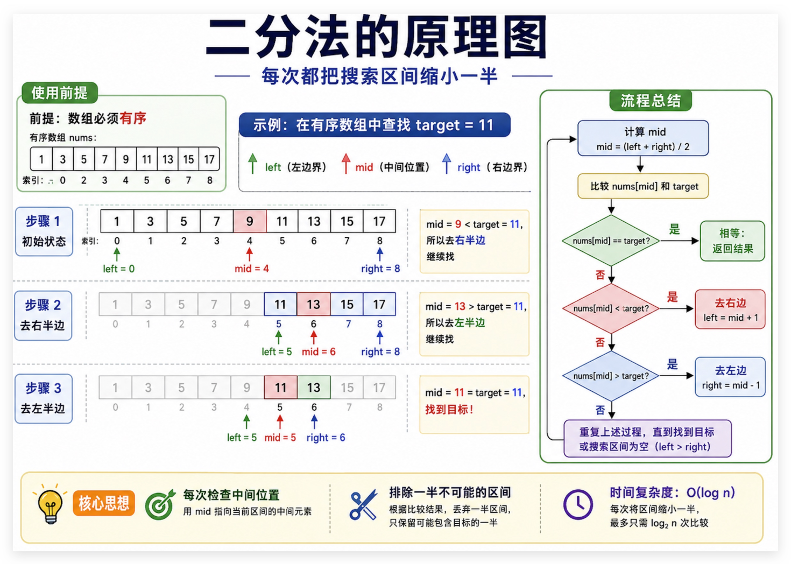
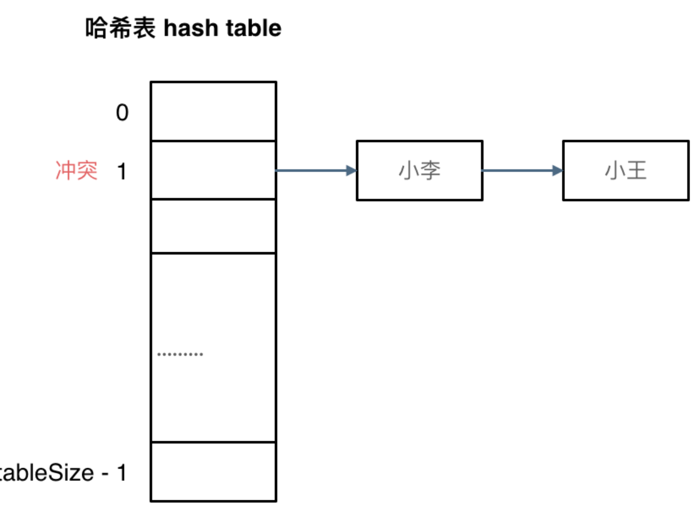
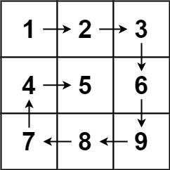

## 常见算法记录

本文档记录常见的算法，用于应付机试。
### 数组

数组中会出现一些算法题目，这里记录一下。
#### 二分查找

二分查找的基本原理如下图中所示。



其中二分查找的实现方法分为多种，较为简单的一种是使用双闭区间，我们定义 target属于一个双闭区间 ，**也就是[left, right] **。

区间的定义这就决定了二分法的代码应该如何写，**因为定义target在[left, right]区间，所以有如下两点：**

- while (left <= right) 要使用 <= ，因为left == right是有意义的，所以使用 <=
- if (nums[middle] > target) right 要赋值为 middle - 1，因为当前这个nums[middle]一定不是target，那么接下来要查找的左区间结束下标位置就是 middle - 1

```cpp
class Solution {
public:
    int search(vector<int>& nums, int target) {
        int left = 0;
        int right = nums.size() - 1; // 定义target在左闭右闭的区间里，[left, right]
        while (left <= right) { // 当left==right，区间[left, right]依然有效，所以用 <=
            int middle = left + ((right - left) / 2);// 防止溢出 等同于(left + right)/2
            if (nums[middle] > target) {
                right = middle - 1; // target 在左区间，所以[left, middle - 1]
            } else if (nums[middle] < target) {
                left = middle + 1; // target 在右区间，所以[middle + 1, right]
            } else { // nums[middle] == target
                return middle; // 数组中找到目标值，直接返回下标
            }
        }
        // 未找到目标值
        return -1;
    }
};
```

#### 双指针

其中双指针的作用是，使用一个快指针和一个慢指针，从而在一个for循环中完成本来应该在两个for循环中完成的任务。

例如在leetcode题目中，存在一移除相同元素的题目。

给你一个数组`nums`和一个值 `val`，你需要 **[原地](https://baike.baidu.com/item/原地算法)** 移除所有数值等于 `val` 的元素。元素的顺序可能发生改变。然后返回 `nums` 中与 `val` 不同的元素的数量。

假设 `nums` 中不等于 `val` 的元素数量为 `k`，要通过此题，您需要执行以下操作：

- 更改 `nums` 数组，使 `nums` 的前 `k` 个元素包含不等于 `val` 的元素。`nums` 的其余元素和 `nums` 的大小并不重要。
- 返回 `k`。


其实第一次看到该题目，想到的是使用STL中的erase直接删除元素，但是刷题过程中最好不要使用这么投机取巧的方法。常规方法下，我们的做法是：**使用两层for循环，第一层中寻找到指定的元素，接着在下一次for循环中将后面的元素前移，覆盖掉该元素**

而使用双指针的做法是，慢指针遇到target不向前移动，用快指针的值覆盖掉慢指针的值。实现方法如下：

```cpp
class Solution {
public:
    int removeElement(vector<int>& nums, int val) {
        int slow = 0;

        for (int fast = 0; fast < nums.size(); fast++) {
            if (val != nums[fast]) {
                nums[slow++] = nums[fast];
            }
        }

        return slow;
    }
};
```

双指针的用法基本上就是这样，还有一道例题如下所示，其中使用的fill方法用于将内容填充为指定的数字。

```cpp
class Solution {
public:
    void moveZeroes(vector<int>& nums) {
        int slow = 0;

        for (int fast = 0; fast < nums.size(); fast++) {
            if (nums[fast] != 0) {
                nums[slow++] = nums[fast];
            }
        }

        fill(nums.begin() + slow, nums.end(), 0);
    }
};
```


#### 滑动窗口

所谓滑动窗口，**就是不断的调节子序列的起始位置和终止位置，从而得出我们想要的结果**。该算法主要用于解决，子啊一个数组或者字符串中，寻找满足某种条件的连续子数组。例如：长度为 k 的连续子数组最大和、最长无重复字符子串等问题。


其中一个典型的题目就是，给定一个含有 n 个正整数的数组和一个正整数 s ，找出该数组中满足其和 ≥ s 的长度最小的连续子数组，并返回其长度。如果不存在符合条件的子数组，返回 0。

所谓的连续子数组，指的就是一个数组中一个连续的部分。那么对于上面的问题，我们的代码如下所示：

``` cpp
class Solution {
public:

    int minSubArrayLen(int target, vector<int>& nums) {
        int left = 0, sum = 0, ans = INT32_MAX;
        
        for (int right = 0; right < nums.size(); right++) {
            sum += nums[right];
            while (sum >= target) {
                ans = min(ans, right - left + 1);
                sum -= nums[left++];
            }
        }
        return ans == INT32_MAX ? 0 : ans;
    }

};
```

同样的这道水果篮子的题目，同样用到了滑动窗口的思想，只不过我通过一个map来维护窗口中的元素，以及其个数。实现的代码如下：

```cpp
class Solution {
public:
    int totalFruit(vector<int>& fruits) {
        unordered_map<int, int> mp;
        int left = 0, ans = 0;
        for (int right = 0; right < fruits.size(); right++) {
            if (mp.size() == 2 && mp.find(fruits[right]) == mp.end()) {
                while (mp.size() == 2) {
                    if (--mp[fruits[left]] == 0) {
                        mp.erase(fruits[left]);
                    }
                    left++;
                }
            }
            mp[fruits[right]]++;
            ans = max(ans, right - left + 1);
        }
        return ans;
    }

};
```

#### 前缀和思想

前缀和思想指的是，提前计算从数组开头到每个位置的累计和，从而快速求任意区间的和。
比如给定一个数组nums，我希望计算任意一个区间[m, n]之间的区间和。如果直接使用加法，那么在需要计算很多个区间和的时候，就需要依次访问数组。

但是我们可以通过一个vec数组，vec[i] = vec[0] + vec[1] + ... + vec[i]
因此如果需要计算[m, n]区间内的和，可以通过计算vec[n] - vec[m - 1]，从而计算出来这个和
实现的代码如下所示：

```cpp
#include <iostream>
#include <vector>
using namespace std;
int main() {
    int n, a, b;
    cin >> n;
    vector<int> vec(n);
    vector<int> p(n);
    int presum = 0;
    for (int i = 0; i < n; i++) {
        cin >> vec[i];
        presum += vec[i];
        p[i] = presum;
    }

    while (cin >> a >> b) {
        int sum;
        if (a == 0) sum = p[b];
        else sum = p[b] - p[a - 1];
        cout << sum << endl;
    }
    
    return 0;
}
```


### 链表

#### 基础知识
链表在C++中常见的定义形式如下，基本上是使用struct形式，实现代码如下：
```cpp
struct ListNode {
    int val;  // 节点上存储的元素
    ListNode *next;  // 指向下一个节点的指针
    ListNode(int x) : val(x), next(NULL) {}  // 节点的构造函数
};
```

在某些机试中，需要手搓结构体，最好记忆一下。

一道移除链表元素的题目（删除所有值为val的元素），实现代码如下：
```cpp
/**
 * Definition for singly-linked list.
 * struct ListNode {
 *     int val;
 *     ListNode *next;
 *     ListNode() : val(0), next(nullptr) {}
 *     ListNode(int x) : val(x), next(nullptr) {}
 *     ListNode(int x, ListNode *next) : val(x), next(next) {}
 * };
 */
class Solution {
public:
    ListNode* removeElements(ListNode* head, int val) {
        ListNode ans(-1, head);
        ListNode* p = &ans;

        while (p->next != nullptr) {
            if (p->next->val == val) {
                p->next = p->next->next;
            }
            else {
                p = p->next;
            }
        }
        return ans.next;
    }

};
```

同时有一道链表反转的题目，我选择的方法是使用头插法，这样就能够实现链表的反转，实现代码如下所示：

```cpp
class Solution {
public:
    ListNode* reverseList(ListNode* head) {
        ListNode* ans = nullptr;
        ListNode* p = head;
        while (p != nullptr) {
            ListNode* temp = p->next;
            p->next = ans;
            ans = p;
            p = temp;
        }
        return ans;
    }
};
```

删除链表的倒数第k个元素，实现代码如下：
```cpp
class Solution {
public:
    ListNode* removeNthFromEnd(ListNode* head, int n) {
        ListNode dummy(0, head);
        ListNode* fast = &dummy;
        ListNode* slow = &dummy;

        for (int i = 0; i < n; i++){
            fast = fast->next;
        }
        while (fast->next != nullptr) {
            fast = fast->next;
            slow = slow->next;
        }
        slow->next = slow->next->next;
        return dummy.next;
    }
};
```


### 哈希表

哈希表又叫做散列表，哈希表中关键码就是数组的索引下标，然后通过下标直接访问数组中的元素，如下图所示。**一般哈希表都是用来快速判断一个元素是否出现集合里**，比如要查询一个名字是否在这所学校里。

要枚举的话时间复杂度是O(n)，但如果使用哈希表的话， 只需要O(1)就可以做到。

我们只需要初始化把这所学校里学生的名字都存在哈希表里，在查询的时候通过索引直接就可以知道这位同学在不在这所学校里了。我们定义一个哈希函数f，可以通过计算f(name)，得到哈希表的坐标，从而判断是否存在这一学生。

#### 哈希冲突

哈希冲突指的是，函数f对于两个不同的值，可能将其映射到同一个结果上。这样会导致哈希冲突。解决哈希冲突的方法如下：
- **拉链法**：小李和小王在索引1的位置发生了冲突，发生冲突的元素都被存储在链表中。 这样我们就可以通过索引找到小李和小王了


其实拉链法就是要选择适当的哈希表的大小，这样既不会因为数组空值而浪费大量内存，也不会因为链表太长而在查找上浪费太多时间。

- **线性探测法** : 使用线性探测法，一定要保证tableSize大于dataSize。 我们需要依靠哈希表中的空位来解决碰撞问题。
	- 例如冲突的位置，放了小李，那么就向下找一个空位放置小王的信息。所以要求tableSize一定要大于dataSize ，要不然哈希表上就没有空置的位置来存放 冲突的数据。

#### 字母异位词

给定两个字符串 s 和 t ，编写一个函数来判断 t 是否是 s 的字母异位词。所谓的字母异位词就是，是不是两个字符串中的字母完全一样，只是顺序不同。

```cpp
class Solution {
public:
    bool isAnagram(string s, string t) {
        vector<int> hash(26, 0);
        
        for (int i = 0; i < s.length(); i++)
            hash[s[i] - 'a']++;

        for (int i = 0; i < t.length(); i++) 
            hash[t[i] - 'a']--;

        for (int i = 0; i < 26; i++) {
            if (hash[i] != 0)
                return false;
        }

        return true;
    }
};
```


#### 快乐数

「快乐数」定义为：对于一个正整数，每一次将该数替换为它每个位置上的数字的平方和，然后重复这个过程直到这个数变为 1，也可能是 无限循环 但始终变不到 1。如果 可以变为  1，那么这个数就是快乐数。

如果 n 是快乐数就返回 True ；不是，则返回 False 。
输入：19  
输出：true  
解释：  
1^2 + 9^2 = 82  
8^2 + 2^2 = 68  
6^2 + 8^2 = 100  
1^2 + 0^2 + 0^2 = 1

那么我们怎么知道一个数不能无限循环变到1呢，对于一个新数，那我们肯定是不知道的。但是如果一个数重复出现了俩次，那我们就知道了：这个数最后还是会得到他自己，没办法得到1。

因此按照这个逻辑，实现代码：
```cpp
class Solution {
public:
    int calculate(int n) {
        int sum = 0;
        
        while (n != 0) {
            int t = n % 10;
            sum += t * t;
            n = n / 10;
        }

        return sum;
    }

    bool isHappy(int n) {
        unordered_set<int> hash;
        int num = n;

        while (hash.find(num) == hash.end()) {
            hash.insert(num);
            num = calculate(num);
            if (num == 1) {
                return true;
            }
        }

        return false;

    }
};
```

#### 两数之和

两数之和也非常简单，就是建一个字典，键对应的是某一个数，值对应的是这个数的下标。在一个for循环中，每次先检查target - nums[i]是否在字典中，如果在说明nums[i]和这个键能够加在一块等于target。

实现代码如下：
```cpp
class Solution {
public:
    vector<int> twoSum(vector<int>& nums, int target) {
        unordered_map<int, int> hashmap;

        for (int i = 0; i < nums.size(); i++) {
            int p = target - nums[i];

            if (hashmap.find(p) != hashmap.end()) {
                return {i, hashmap[p]};
            }

            hashmap[nums[i]] = i;
        }

        return {};
    }
};
```

### 字符串

字符串中常考的内容就是原地修改、局部反转、模式匹配与周期性判断，并结合数组和双指针理解底层操作。其中比较重要的就是KMP算法。

#### 反转字符串

实际实现很简单，自己看吧：

```cpp
class Solution {
public:
    void reverseString(vector<char>& s) {
        int n = s.size();

        for (int i = 0; i < n / 2; i++) {
            swap(s[i], s[n - i - 1]);
        }
    }
};
```

#### KMP算法

KMP算法用于在一个串中，找到一个子字符串。其中给定的字符串叫做文本串，要寻找的子串叫做模式串。在KMP算法中，当出现匹配不对的情况时，不退回文本串。

比如模式串为abcabd，我现在匹配到abcab，然后最后一个字符匹配失败了。这样我就知道文本串的最后两个字符为ab，而模式串的开头也是ab，因此就可以直接省略了其他比较，用模式串的开头对准文本串的最后两个字符。

计算next数组的代码如下所示：

```cpp
#inlcude<vector>
#include<iostream>
using namespace std;

vector<int> calculateNext(vector<int>& p) {
	int n = p.size();
	vector<int> next(n, 0);
	int var = next[0];
	
	for (int i = 1; i < n; i++) {
		while (var > 0 && p[var] != p[i]) {
			var = next[var - 1];
		}
		
		if (p[var] == p[i])
			var++;
			
		next[i] = var;
	}
	
	return var;
}
```


### 热题HOT100

#### 连续最长序列

给定一个未排序的整数数组 `nums` ，找出数字连续的最长序列（不要求序列元素在原数组中连续）的长度。

请你设计并实现时间复杂度为 `O(n)` 的算法解决此问题。

**示例 1：**

```
输入：nums = [100,4,200,1,3,2]
输出：4
解释：最长数字连续序列是 [1, 2, 3, 4]。它的长度为 4。
```


**思路解析：**本题使用哈希表的思想。在C++中，可以当作哈希表使用的容器一般有：**unordered_map、unordered_set、vector**。使用**map**的结构，一般是需要实现键和值的映射，如统计某个元素出现的次数，记录某个值的位置等。

而**set**则是关心某一个值是否出现，常用于判断数组是否有重复元素、判断某个数组是否出现过等问题。**vector**则是比较简单，直接使用数组下标作为key，是map的一种平替。但是某些时候键值过大，使用数组需要用大很大的空间，这种时候使用map则更加的方便。

在本题中，只关心某个元素是否出现过。如我们已知x，我们希望找到其后续节点x+1，我们需要快速判断x+1是否出现，因此使用数据结构set。

而为了降低时间复杂度，我们可以避免一些无效搜索。如果x-1存在，那么x的长度一定不如x-1，所以就可以跳过x了。根据上面的思想，撰写代码如下所示。

```cpp
class Solution {
public:
    int longestConsecutive(vector<int>& nums) {
        unordered_set<int> num_set;
        int len = 0;

        for (int num : nums ) {
            num_set.insert(num);
        }

        for (int num : num_set) {
            if (!num_set.count(num - 1)) {
                int current_num = num;
                int current_len = 1;
                while (num_set.count(current_num + 1)) {
                    current_len++;
                    current_num++;
                }

                len = max(len, current_len);
            }

        }

        return len;
    }
};
```


#### 移动零

给定一个数组 `nums`，编写一个函数将所有 `0` 移动到数组的末尾，同时保持非零元素的相对顺序。

**请注意** ，必须在不复制数组的情况下原地对数组进行操作。

**示例 1:**

```
输入: nums = [0,1,0,3,12]
输出: [1,3,12,0,0]
```

B使用双指针的方法。如果遇到0，就移动快指针；如果遇到的不是0，就快慢指针一起移动。很简单的题目，代码在上面的双指针章节中已经给出了。


#### 盛水最多的容器

给定一个长度为 `n` 的整数数组 `height` 。有 `n` 条垂线，第 `i` 条线的两个端点是 `(i, 0)` 和 `(i, height[i])` 。

找出其中的两条线，使得它们与 `x` 轴共同构成的容器可以容纳最多的水。

返回容器可以储存的最大水量。

**思路解析：**使用双指针算法即可。采用左指针和右指针，左边的指针向右移动的话，想要area变大，那么height[left]必须要大于现在的值才行，因为left增加了，宽变小了，高必须变大。右指针也是同理。

而每次我们移动两者中最小的，才有可能将容量变得更大。实现代码如下：

```cpp
class Solution {
public:
    int maxArea(vector<int>& height) {
        int left = 0, right = height.size() - 1;
        int max_area = min(height[left], height[right]) * right;

        while (left < right) {
            if (height[left] < height[right]) {
                // lower is height, here is left
                int current = height[left];
                while (left < right && height[++left] <= current);
            }

            else {
                // right is lower
                int current = height[right];
                while (left < right && height[--right] <= current);
            }
            if (left >= right)  break;
            
            int current_area = (right - left) * min(height[left], height[right]);
            max_area = max(max_area, current_area);
        }

        return max_area;

    }
};
```


#### 三数之和

给你一个整数数组 `nums` ，判断是否存在三元组 `[nums[i], nums[j], nums[k]]` 满足 `i != j`、`i != k` 且 `j != k` ，同时还满足 `nums[i] + nums[j] + nums[k] == 0` 。请你返回所有和为 `0` 且不重复的三元组。

**思路解析：**这题也没有什么特别的思路，我使用的就是排序后使用双指针。使得nums[j] + nums[k] == -nums[i]。这样实际上是转化成了两数之和的问题，使用双指针的思想如下所示。

```cpp
class Solution {
public:
    vector<vector<int>> threeSum(vector<int>& nums) {
        vector<vector<int>> ans;
        sort(nums.begin(), nums.end());
        for (int i = 0; i < nums.size(); i++) {
            if (nums[i] > 0) {
                break;
            }
            if (i > 0 && nums[i] == nums[i - 1]) {
                continue;
            }
            int left = i + 1;
            int right = nums.size() - 1;

            while (left < right) {
                int sum = nums[i] + nums[left] + nums[right];

                if (sum < 0) {
                    left++;
                }
                else if (sum > 0) {
                    right--;
                }
                else {
                    ans.push_back({
                        nums[i],
                        nums[left],
                        nums[right]
                    });

                    while (left < right &&
                           nums[left] == nums[left + 1]) {
                        left++;
                    }
                    while (left < right &&
                           nums[right] == nums[right - 1]) {
                        right--;
                    }
                    left++;
                    right--;
                }
            }
        }

        return ans;
    }
};
```

#### 接雨水

给定 `n` 个非负整数表示每个宽度为 `1` 的柱子的高度，计算按此排列的柱子，下雨之后能够接多少雨水。

**思路解析：**这道题使用双指针算法。对于某一个位置来说，它能够接到多少水，并不是由自己决定的，而是由它左边最高的柱子和右边最高的柱子共同决定的。

也就是说，对于下标 `i` 来说，当前位置能够接到的雨水数量为：

```cpp
min(左边最高柱子, 右边最高柱子) - height[i]
```

如果这个值小于等于0，说明当前位置本身就比较高，无法接水；如果这个值大于0，那么当前位置就可以接到对应高度的水。

最朴素的方法是，对于每一个位置都向左、向右分别扫描一遍，找到左边最大值和右边最大值。但是这样时间复杂度会变成O(n^2)。为了优化这个过程，可以使用双指针。

代码中设置了两个指针：

- `left`：从数组最左侧开始。
- `right`：从数组最右侧开始。
- `leftMax`：记录从左侧到当前位置为止，左边出现过的最高柱子。
- `rightMax`：记录从右侧到当前位置为止，右边出现过的最高柱子。
- `ans`：记录最终能够接到的雨水总量。

关键点在于：每次比较 `height[left]` 和 `height[right]`，移动较矮的一侧。

如果 `height[left] < height[right]`，说明右边当前至少存在一个比 `height[left]` 更高的柱子。此时对于 `left` 位置来说，右边的限制已经足够高，真正决定它能不能接水的就是左边最高柱子 `leftMax`。

因此：

- 如果 `height[left] >= leftMax`，说明当前位置比之前左边的柱子都高，那么它不能接水，只需要更新 `leftMax`。
- 如果 `height[left] < leftMax`，说明当前位置被左边最高柱子挡住，并且右边也有更高的柱子作为边界，所以这里可以接 `leftMax - height[left]` 的水。

右侧同理。如果 `height[left] >= height[right]`，说明左边当前至少存在一个不低于 `height[right]` 的柱子。此时对于 `right` 位置来说，左边边界已经足够，真正决定它能不能接水的就是右边最高柱子 `rightMax`。

所以：

- 如果 `height[right] >= rightMax`，更新 `rightMax`。
- 如果 `height[right] < rightMax`，说明当前位置可以接 `rightMax - height[right]` 的水。

这个代码的本质就是：**从两边向中间收缩，每次处理较矮的一边，因为较矮的一边的接水量已经可以确定，不需要再等待另一边继续移动。**

实现代码如下：

```cpp
class Solution {
public:
    int trap(vector<int>& height) {
        int left = 0;
        int right = height.size() - 1;

        int leftMax = 0;
        int rightMax = 0;

        int ans = 0;

        while (left < right) {
            if (height[left] < height[right]) {
                if (height[left] >= leftMax) {
                    leftMax = height[left];
                } else {
                    ans += leftMax - height[left];
                }

                left++;
            } else {
                if (height[right] >= rightMax) {
                    rightMax = height[right];
                } else {
                    ans += rightMax - height[right];
                }

                right--;
            }
        }

        return ans;
    }
};
```

这段代码只遍历了一次数组，每个位置最多被左右指针访问一次，所以时间复杂度是O(n)。同时它只使用了几个变量来记录左右两边的最大高度，没有额外使用数组，所以空间复杂度是O(1)。


#### 无重复字符的最长字串

给定一个字符串 `s` ，请你找出其中不含有重复字符的 **最长 子串** 的长度。

**思路解析：**由于是子串问题，因此我们会优先想到滑动窗口算法。滑动窗口算法的目的，就是为了解决子串和子数组问题的。那么我们可以分别设置窗口的两个边界，slow和fast。fast每次向窗口中添加元素，如果该字符没有在之前出现在窗口中过，那么就直接添加。如果该元素出现在窗口中，那么需要收缩窗口，移动slow指针，直到该窗口中只有一次出现过该字符。

实现代码如下所示：

```cpp
class Solution {
public:
    int lengthOfLongestSubstring(string s) {
        vector<int> hash(128, 0);
        int ans = 0;
        int slow = 0;

        for (int fast = 0; fast < s.length(); fast++) {
            if (hash[s[fast]] != 0) {
                // 新字符在窗口中已经出现过了，需要移动左指针
                while (hash[s[fast]] != 0) {
                    hash[s[slow++]] = 0;
                }
            }     
            hash[s[fast]] = 1;
            ans = max(ans, fast - slow + 1);
        }

        return ans;
    }
};
```


#### 和为k的子数组

给你一个整数数组 `nums` 和一个整数 `k` ，请你统计并返回 *该数组中和为 `k` 的子数组的个数* 。

子数组是数组中元素的连续非空序列。

**思路解析：**

代码如下所示：

```cpp
class Solution {
public:
    int subarraySum(vector<int>& nums, int k) {
        unordered_map<int, int> hash;
        hash[0] = 1;

        int prefixSum = 0;
        int ans = 0;

        for (int num : nums) {
            prefixSum += num;

            if (hash.count(prefixSum - k)) {
                ans += hash[prefixSum - k];
            }

            hash[prefixSum]++;
        }

        return ans;
    }
};
```


#### 最大子数组和

**思路解析：**本题采用动态规划的思想，动态规划指的是将一个大问题拆分为若干小问题，用小问题解决大问题。本题中要求出数组中的和最大的子数组，且这个子数组中必须要有元素，这样使用传统的双指针或者滑动窗口，会很难处理只有一个元素的情况，同时何时移动窗口也不容易被确定。

因此我们可以使用动态规划，数组ans中存放的是以nums[i]结尾的和最长的子数组，那么ans[i] = max(nums[i], ans[i - 1] + nums[i])。

注意最后返回的最大值，不一定是以最后一个元素结尾的，所以应该返回ans中的最大值。

```cpp
class Solution {
public:
    int maxSubArray(vector<int>& nums) {
        int n = nums.size();
        vector<int> ans(n);

        ans[0] = nums[0];
        for (int i = 1; i < n; i++) {
            ans[i] = max(nums[i], ans[i - 1] + nums[i]);
        }
        
        return *max_element(ans.begin(), ans.end());
    }
};
```

#### [54. Spiral Matrix](https://leetcode.cn/problems/spiral-matrix/)

Given an `m x n` `matrix`, return *all elements of the* `matrix` *in spiral order*.

**思路解析：**上述题目的意思是，循环打印出一个数组，如图中所示。



那么对于这种题目，也没有什么特别的算法可以用，直接模拟即可。其中比较难的是边界判定，就是当我输出到某一个位置，我该怎么判断是调转方向，还是继续按照原方向走。

通过观察可以发现，数组的移动路径为：左、下、右、上，依次循环。因此我们可以尝试定义一个方向数组，如果到达边界，或者继续按原方向走，发现下一个元素被走过了，我们就调转方向。整体代码的实现如下所示，很好的题目。

```cpp
class Solution {
public:
    vector<int> spiralOrder(vector<vector<int>>& matrix) {
        if (matrix.size() == 0 || matrix[0].size() == 0) {
            return {};
        }

        int rows = matrix.size(), columns = matrix[0].size();
        vector<vector<int>>direction = {{0, 1}, {1, 0}, {0, -1}, {-1, 0}};
        vector<vector<bool>> visited(rows, vector<bool>(columns));
        int total = rows * columns;

        int row = 0, column = 0; 
        int directionIndex = 0;
        vector<int> ans(total);

        for (int i = 0; i < total; i++) {
            ans[i] = matrix[row][column];
            visited[row][column] = true;

            int nextRow = row + direction[directionIndex][0];
            int nextColumn = column + direction[directionIndex][1];
            if (nextRow < 0 || nextRow >= rows || nextColumn < 0 || nextColumn >= columns || visited[nextRow][nextColumn]) {
                directionIndex = (directionIndex + 1) % 4;
            }

            row += direction[directionIndex][0];
            column += direction[directionIndex][1];
        }

        return ans;


    }
};
```

#### [240. Search a 2D Matrix II](https://leetcode.cn/problems/search-a-2d-matrix-ii/)

Write an efficient algorithm that searches for a value `target` in an `m x n` integer matrix `matrix`. This matrix has the following properties:

- Integers in each row are sorted in ascending from left to right.
- Integers in each column are sorted in ascending from top to bottom.

**思路解析**：一开始想到的是逐行使用二分搜索，实现代码如下所示，但是时间复杂度超过了。

```cpp
class Solution {
public:
    int searchRow(vector<int> nums, int target, int restrict_column) {
        int left = 0, right = restrict_column;

        while (left <= right) {
            int mid = (left + right) / 2;
            if (nums[mid] == target) {
                return mid;
            }
            else if (nums[mid] < target) {
                // target在mid右边
                left = mid + 1;
            }
            else {
                // target在mid左边
                right = mid - 1;
            }
        }
        return right;
    }

    bool searchMatrix(vector<vector<int>>& matrix, int target) {
        int rows = matrix.size(), columns = matrix[0].size();
        if (rows == 0 || columns == 0) {
            return false;
        }

        int restrict_column = columns - 1;

        for (int i = 0; i < rows; i++) {
            int res = searchRow(matrix[i], target, restrict_column);
            if (res < 0) {
                return false;
            }
            if (matrix[i][res] == target) {
                return true;
            }
            restrict_column = res;
        }

        return false;

    }
};
```

后面看了题解，发现题解的思路很巧妙。我们从第一行的最后一个元素开始，如果nums[row]\[column]>target，那么该列下面的所有元素都大于target，可以直接跳到前一列，因此column--。如果nums[row]\[column]<target，那么该行前面的元素全部都小于target，也不用看了，row--。

因此得到代码如下所示：

```cpp
class Solution {
public:
    bool searchMatrix(vector<vector<int>>& matrix, int target) {
        int rows = matrix.size(), columns = matrix[0].size();
        int row = 0, column = columns - 1;

        while (row < rows && column >= 0) {
            if (matrix[row][column] == target)
                return true;
            else if (matrix[row][column] > target) {
                // 说明这一列都大于target
                column--;
            }
            else {
                row++;
            }
        }

        return false;
    }
};
```

哎，编程真的很神奇。

#### [234. 回文链表](https://leetcode.cn/problems/palindrome-linked-list/)

给你一个单链表的头节点 `head` ，请你判断该链表是否为回文链表。如果是，返回 `true` ；否则，返回 `false` 。

**思路解析：**

其实这道题目解决很简单，实在不行开辟一个长度为n的数组，将链表复制到数组中比较即可。主要的是，在其中遇到了一些思想，感觉很nb，因此写下来记录一下。

**1、**其一是，如果需要将链表逆序，可以使用递归和栈的方式。其实递归和栈是等价的，只是实现方式不一样的。这题使用快慢指针的方法，就是一个指针一次走两步，一个一次走一步。这样慢指针会到达中间节点，快指针会到达末尾节点。

接着将慢指针后面的内容全部翻转，然后依次和前面的进行比较，实现o(1)的时间复杂度完成题解。

**2、**空间复杂度为o(n)的方式，比较快的就是使用栈。回文本质上就是将字符扔进栈，然后再全部弹出嘛

实现的代码如下所示：

```cpp
/**
 * Definition for singly-linked list.
 * struct ListNode {
 *     int val;
 *     ListNode *next;
 *     ListNode() : val(0), next(nullptr) {}
 *     ListNode(int x) : val(x), next(nullptr) {}
 *     ListNode(int x, ListNode *next) : val(x), next(next) {}
 * };
 */
class Solution {
public:
    bool isPalindrome(ListNode* head) {
        stack<int> s;
        ListNode *ptr = head;

        while (ptr != nullptr) {
            s.push(ptr->val);
            ptr = ptr->next;
        }

        bool ans = true;
        ptr = head;
        while (ans && ptr != nullptr) {
            if (ptr->val != s.top())
                ans = false;
            ptr = ptr->next;
            s.pop();
        }

        return ans;
    }
};
```

 #### [141. 环形链表](https://leetcode.cn/problems/linked-list-cycle/)

给你一个链表的头节点 `head` ，判断链表中是否有环

**思路解析：**

一开始想到的是用哈希表的方法，将路过的节点入hash_set，如果有重复入的就返回true，如果遇到nullptr就说明无环，返回false。上述方法能够通过，但是时间有点慢，后面看解析知道，可以使用双指针的方式。

快慢指针，在一个环中，一定会相遇。因为快指针每次比慢指针多走1步，那么相当于慢指针不动，快指针每次以1的速度追赶慢指针。只要俩者进入环中，就一定会相遇。实现代码如下所示：

```cpp
/**
 * Definition for singly-linked list.
 * struct ListNode {
 *     int val;
 *     ListNode *next;
 *     ListNode(int x) : val(x), next(NULL) {}
 * };
 */
class Solution {
public:
    bool hasCycle(ListNode *head) {
        if (head == nullptr || head->next == nullptr) {
            return false;
        }

        ListNode *slow = head;
        ListNode *fast = head;

        while (fast != nullptr && fast->next != nullptr) {
            fast = fast->next->next;
            slow = slow->next;
            if (fast == slow) {
                return true;
            }
        }

        return false;
    }
};
```


### 排序

排序算法是机试和专业面试中非常常见的基础内容。复习排序时，不能只记住函数名，而是要弄清楚三个问题：

- 每一趟排序在做什么。
- 哪些元素已经有序，哪些元素还没有处理。
- 时间复杂度、空间复杂度和稳定性分别是什么。

下面给出常见排序算法的思路和对应 C++ 代码。为了方便理解，代码都统一写成对 `vector<int>& nums` 进行升序排序。

#### 冒泡排序

冒泡排序的思想是：每一趟不断比较相邻的两个元素，如果前面的元素比后面的元素大，就交换它们。这样一趟结束后，当前未排序部分中的最大值会被“冒泡”到最后。

**思路解析：**

假设数组长度为 `n`：

- 第 1 趟排序后，最大元素会在下标 `n - 1` 的位置。
- 第 2 趟排序后，第二大元素会在下标 `n - 2` 的位置。
- 每一趟都可以少比较一个已经确定位置的元素。

如果某一趟排序中没有发生任何交换，说明数组已经有序，可以提前结束。

实现代码如下：

```cpp
#include <vector>
using namespace std;

void bubbleSort(vector<int>& nums) {
    int n = nums.size();

    for (int i = 0; i < n - 1; i++) {
        bool swapped = false;

        for (int j = 0; j < n - 1 - i; j++) {
            if (nums[j] > nums[j + 1]) {
                swap(nums[j], nums[j + 1]);
                swapped = true;
            }
        }

        if (!swapped) {
            break;
        }
    }
}
```

复杂度：

- 最好时间复杂度：O(n)，数组本来有序，并且使用了 `swapped` 优化。
- 平均时间复杂度：O(n^2)。
- 最坏时间复杂度：O(n^2)。
- 空间复杂度：O(1)。
- 稳定性：稳定。因为相等元素不会交换相对位置。

#### 选择排序

选择排序的思想是：每一趟从未排序部分中选出最小元素，把它放到未排序部分的开头。

**思路解析：**

选择排序维护两个区间：

- `[0, i - 1]` 是已经排好序的区间。
- `[i, n - 1]` 是还没有排序的区间。

每一趟在未排序区间中找到最小值下标 `minIndex`，然后与 `nums[i]` 交换。

实现代码如下：

```cpp
#include <vector>
using namespace std;

void selectionSort(vector<int>& nums) {
    int n = nums.size();

    for (int i = 0; i < n - 1; i++) {
        int minIndex = i;

        for (int j = i + 1; j < n; j++) {
            if (nums[j] < nums[minIndex]) {
                minIndex = j;
            }
        }

        if (minIndex != i) {
            swap(nums[i], nums[minIndex]);
        }
    }
}
```

复杂度：

- 最好、平均、最坏时间复杂度都是 O(n^2)。
- 空间复杂度：O(1)。
- 稳定性：不稳定。

选择排序不稳定的原因是交换可能跨过相同元素。例如：

```text
2a 2b 1
```

第一趟会把 1 和 2a 交换，变成：

```text
1 2b 2a
```

此时 2a 和 2b 的相对顺序改变了。

#### 插入排序

插入排序的思想是：把数组分成已排序区间和未排序区间，每次从未排序区间取出一个元素，插入到已排序区间的合适位置。

**思路解析：**

直接插入排序很像整理扑克牌：

- 手里已经拿着的牌是有序的。
- 每次摸一张新牌，把它插入到合适位置。

在代码中，`nums[0...i-1]` 是有序区间，`nums[i]` 是当前待插入元素。我们从后往前扫描，把比 `key` 大的元素整体后移，最后把 `key` 放到空出来的位置。

实现代码如下：

```cpp
#include <vector>
using namespace std;

void insertionSort(vector<int>& nums) {
    int n = nums.size();

    for (int i = 1; i < n; i++) {
        int key = nums[i];
        int j = i - 1;

        while (j >= 0 && nums[j] > key) {
            nums[j + 1] = nums[j];
            j--;
        }

        nums[j + 1] = key;
    }
}
```

复杂度：

- 最好时间复杂度：O(n)，数组本来有序。
- 平均时间复杂度：O(n^2)。
- 最坏时间复杂度：O(n^2)，数组逆序。
- 空间复杂度：O(1)。
- 稳定性：稳定。因为只有 `nums[j] > key` 时才移动，相等元素不会越过彼此。

#### 希尔排序

希尔排序是插入排序的改进，也叫缩小增量排序。它先让相隔较远的元素进行插入排序，使数组大致有序；最后当增量为 1 时，再做一次普通插入排序。

**思路解析：**

普通插入排序一次只能把元素向前移动一格，若小元素在很靠后的位置，移动成本很高。希尔排序通过设置间隔 `gap`，让元素可以跨越较大距离移动。

例如 `gap = 5` 时，会把下标相差 5 的元素看成一组进行插入排序。之后逐渐缩小 `gap`，直到 `gap = 1`。

实现代码如下：

```cpp
#include <vector>
using namespace std;

void shellSort(vector<int>& nums) {
    int n = nums.size();

    for (int gap = n / 2; gap > 0; gap /= 2) {
        for (int i = gap; i < n; i++) {
            int key = nums[i];
            int j = i - gap;

            while (j >= 0 && nums[j] > key) {
                nums[j + gap] = nums[j];
                j -= gap;
            }

            nums[j + gap] = key;
        }
    }
}
```

复杂度：

- 时间复杂度与增量序列有关，通常优于 O(n^2)，但基础写法常按 O(n^2) 记忆。
- 空间复杂度：O(1)。
- 稳定性：不稳定。因为相同元素可能在不同分组中被跨距离移动。

#### 归并排序

归并排序采用分治思想：先把数组不断分成左右两半，分别排好序，再把两个有序数组合并成一个有序数组。

**思路解析：**

归并排序分为两个阶段：

1. 分：递归地把数组拆成更小的区间，直到区间长度为 1。
2. 合：将两个已经有序的子区间合并。

归并排序的关键在于合并两个有序区间。使用两个指针分别指向左右区间的开头，每次把较小元素放入临时数组。

实现代码如下：

```cpp
#include <vector>
using namespace std;

void merge(vector<int>& nums, int left, int mid, int right, vector<int>& temp) {
    int i = left;
    int j = mid + 1;
    int k = left;

    while (i <= mid && j <= right) {
        if (nums[i] <= nums[j]) {
            temp[k++] = nums[i++];
        } else {
            temp[k++] = nums[j++];
        }
    }

    while (i <= mid) {
        temp[k++] = nums[i++];
    }

    while (j <= right) {
        temp[k++] = nums[j++];
    }

    for (int p = left; p <= right; p++) {
        nums[p] = temp[p];
    }
}

void mergeSort(vector<int>& nums, int left, int right, vector<int>& temp) {
    if (left >= right) {
        return;
    }

    int mid = left + (right - left) / 2;

    mergeSort(nums, left, mid, temp);
    mergeSort(nums, mid + 1, right, temp);
    merge(nums, left, mid, right, temp);
}

void mergeSort(vector<int>& nums) {
    if (nums.empty()) {
        return;
    }

    vector<int> temp(nums.size());
    mergeSort(nums, 0, nums.size() - 1, temp);
}
```

复杂度：

- 时间复杂度：O(n log n)。
- 空间复杂度：O(n)。
- 稳定性：稳定。合并时如果左右元素相等，优先取左边元素即可保持相对顺序。

#### 快速排序

快速排序也采用分治思想。它每次选择一个基准值 `pivot`，通过一趟划分把小于等于基准值的元素放到左边，大于等于基准值的元素放到右边，然后递归排序左右两部分。

**思路解析：**

快速排序的核心是 `partition` 划分过程。

下面代码使用左右指针法：

- 选择区间左端点作为 `pivot`。
- `i` 从左向右找大于等于 `pivot` 的元素。
- `j` 从右向左找小于等于 `pivot` 的元素。
- 如果 `i < j`，交换这两个元素。
- 最后把 `pivot` 放到最终位置。

实现代码如下：

```cpp
#include <vector>
using namespace std;

int partition(vector<int>& nums, int left, int right) {
    int pivot = nums[left];
    int i = left;
    int j = right;

    while (i < j) {
        while (i < j && nums[j] >= pivot) {
            j--;
        }
        while (i < j && nums[i] <= pivot) {
            i++;
        }
        if (i < j) {
            swap(nums[i], nums[j]);
        }
    }

    nums[left] = nums[i];
    nums[i] = pivot;
    return i;
}

void quickSort(vector<int>& nums, int left, int right) {
    if (left >= right) {
        return;
    }

    int pivotIndex = partition(nums, left, right);
    quickSort(nums, left, pivotIndex - 1);
    quickSort(nums, pivotIndex + 1, right);
}

void quickSort(vector<int>& nums) {
    if (nums.empty()) {
        return;
    }

    quickSort(nums, 0, nums.size() - 1);
}
```

复杂度：

- 平均时间复杂度：O(n log n)。
- 最坏时间复杂度：O(n^2)。例如数组本来有序且总选第一个元素为 pivot。
- 平均空间复杂度：O(log n)，来自递归栈。
- 最坏空间复杂度：O(n)。
- 稳定性：不稳定。

注意：工程中常用随机选择 pivot 或三数取中来降低退化概率。

#### 堆排序

堆排序利用堆这种数据结构。升序排序通常使用大根堆，因为大根堆的堆顶是当前最大值。

**思路解析：**

堆排序分为两步：

1. 建堆：把整个数组调整成大根堆。
2. 排序：每次把堆顶最大值和堆尾交换，然后缩小堆范围，再对堆顶向下调整。

大根堆的性质是：每个父结点都不小于自己的左右孩子。这样堆顶一定是当前堆中的最大值。

实现代码如下：

```cpp
#include <vector>
using namespace std;

void heapify(vector<int>& nums, int n, int i) {
    int largest = i;
    int left = 2 * i + 1;
    int right = 2 * i + 2;

    if (left < n && nums[left] > nums[largest]) {
        largest = left;
    }

    if (right < n && nums[right] > nums[largest]) {
        largest = right;
    }

    if (largest != i) {
        swap(nums[i], nums[largest]);
        heapify(nums, n, largest);
    }
}

void heapSort(vector<int>& nums) {
    int n = nums.size();

    for (int i = n / 2 - 1; i >= 0; i--) {
        heapify(nums, n, i);
    }

    for (int i = n - 1; i > 0; i--) {
        swap(nums[0], nums[i]);
        heapify(nums, i, 0);
    }
}
```

复杂度：

- 建堆时间复杂度：O(n)。
- 排序总时间复杂度：O(n log n)。
- 空间复杂度：O(1)，如果不考虑递归版 `heapify` 的栈空间；也可以写成迭代版。
- 稳定性：不稳定。

#### 计数排序

计数排序不是基于比较的排序。它适用于整数范围比较小的情况。

**思路解析：**

计数排序的核心是统计每个数出现了多少次，然后按照数值从小到大依次输出。

例如数组：

```text
2 5 2 3
```

统计出现次数：

```text
2 出现 2 次
3 出现 1 次
5 出现 1 次
```

最后输出：

```text
2 2 3 5
```

下面代码可以处理包含负数的情况。

实现代码如下：

```cpp
#include <vector>
#include <algorithm>
using namespace std;

void countingSort(vector<int>& nums) {
    if (nums.empty()) {
        return;
    }

    int minValue = *min_element(nums.begin(), nums.end());
    int maxValue = *max_element(nums.begin(), nums.end());
    int range = maxValue - minValue + 1;

    vector<int> count(range, 0);

    for (int num : nums) {
        count[num - minValue]++;
    }

    int index = 0;
    for (int i = 0; i < range; i++) {
        while (count[i] > 0) {
            nums[index++] = i + minValue;
            count[i]--;
        }
    }
}
```

复杂度：

- 时间复杂度：O(n + k)，k 是数据范围大小。
- 空间复杂度：O(k)。
- 稳定性：上面这个简单写法不强调稳定；如果使用前缀和并从后向前放置，可以写成稳定版本。

适用场景：

- 数据是整数。
- 最大值和最小值差距不大。

#### 桶排序

桶排序的思想是：把数据按范围分到不同桶中，每个桶内部再排序，最后按桶顺序依次合并。

**思路解析：**

桶排序适合数据分布比较均匀的情况。若数据被均匀分散到各个桶中，每个桶内排序的规模就比较小，整体效率会比较高。

下面代码给出一个整数数组的简单桶排序写法。先计算最大值和最小值，再按照桶大小 `bucketSize` 把元素放到对应桶里。

实现代码如下：

```cpp
#include <vector>
#include <algorithm>
using namespace std;

void bucketSort(vector<int>& nums, int bucketSize = 5) {
    if (nums.empty()) {
        return;
    }

    int minValue = *min_element(nums.begin(), nums.end());
    int maxValue = *max_element(nums.begin(), nums.end());

    int bucketCount = (maxValue - minValue) / bucketSize + 1;
    vector<vector<int>> buckets(bucketCount);

    for (int num : nums) {
        int index = (num - minValue) / bucketSize;
        buckets[index].push_back(num);
    }

    int pos = 0;
    for (auto& bucket : buckets) {
        sort(bucket.begin(), bucket.end());
        for (int num : bucket) {
            nums[pos++] = num;
        }
    }
}
```

复杂度：

- 平均时间复杂度：接近 O(n + k)，k 是桶的数量。
- 最坏时间复杂度：O(n^2)，如果所有元素都落入同一个桶且桶内排序退化。
- 空间复杂度：O(n + k)。
- 稳定性：取决于桶内排序算法。上面使用 `sort`，通常不保证稳定。

#### 基数排序

基数排序也是非比较排序。它按照数字的每一位进行排序，常见写法是从低位到高位，也就是 LSD 基数排序。

**思路解析：**

以十进制整数为例：

1. 先按个位排序。
2. 再按十位排序。
3. 再按百位排序。
4. 直到最高位。

每一位排序必须稳定，否则低位已经排好的顺序会被破坏。

下面代码处理非负整数数组。

实现代码如下：

```cpp
#include <vector>
#include <algorithm>
using namespace std;

void radixSort(vector<int>& nums) {
    if (nums.empty()) {
        return;
    }

    int maxValue = *max_element(nums.begin(), nums.end());

    for (int exp = 1; maxValue / exp > 0; exp *= 10) {
        vector<int> output(nums.size());
        vector<int> count(10, 0);

        for (int num : nums) {
            int digit = (num / exp) % 10;
            count[digit]++;
        }

        for (int i = 1; i < 10; i++) {
            count[i] += count[i - 1];
        }

        for (int i = nums.size() - 1; i >= 0; i--) {
            int digit = (nums[i] / exp) % 10;
            output[count[digit] - 1] = nums[i];
            count[digit]--;
        }

        nums = output;
    }
}
```

复杂度：

- 时间复杂度：O(d(n + r))。
- d 是最大数字的位数。
- r 是基数，十进制中 r = 10。
- 空间复杂度：O(n + r)。
- 稳定性：稳定。

注意：上面代码只适合非负整数。如果数组中有负数，需要把负数和非负数分开处理，或者做额外偏移。

#### 排序算法总结

| 排序算法 | 平均时间复杂度 | 最坏时间复杂度 | 空间复杂度 | 稳定性 |
|---|---|---|---|---|
| 冒泡排序 | O(n^2) | O(n^2) | O(1) | 稳定 |
| 选择排序 | O(n^2) | O(n^2) | O(1) | 不稳定 |
| 插入排序 | O(n^2) | O(n^2) | O(1) | 稳定 |
| 希尔排序 | 依赖增量 | 依赖增量 | O(1) | 不稳定 |
| 归并排序 | O(n log n) | O(n log n) | O(n) | 稳定 |
| 快速排序 | O(n log n) | O(n^2) | O(log n) | 不稳定 |
| 堆排序 | O(n log n) | O(n log n) | O(1) | 不稳定 |
| 计数排序 | O(n+k) | O(n+k) | O(k) | 可稳定实现 |
| 桶排序 | 接近 O(n+k) | O(n^2) | O(n+k) | 取决于桶内排序 |
| 基数排序 | O(d(n+r)) | O(d(n+r)) | O(n+r) | 稳定 |

机试中最常用的是快速排序思想、归并排序思想和堆排序思想。实际写题时，如果题目没有要求手写排序，可以直接使用：

```cpp
sort(nums.begin(), nums.end());
```

但是如果面试官追问底层原理，就要能说明快速排序、归并排序、堆排序之间的区别。


